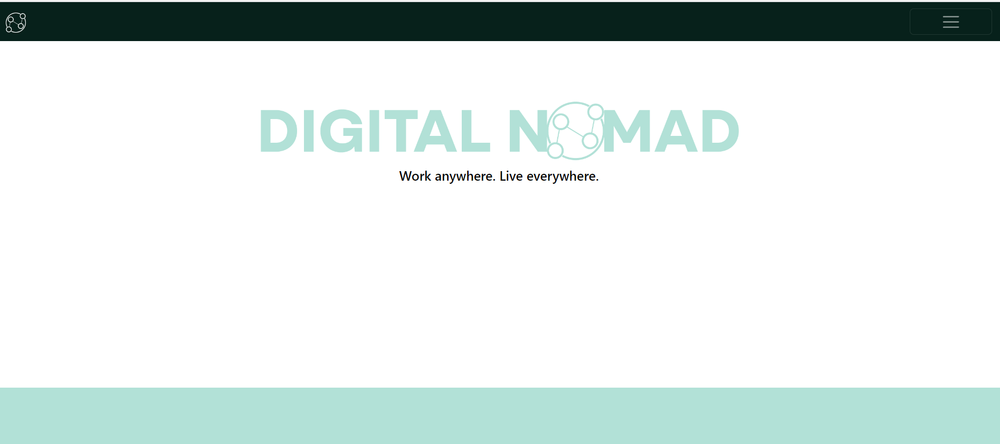
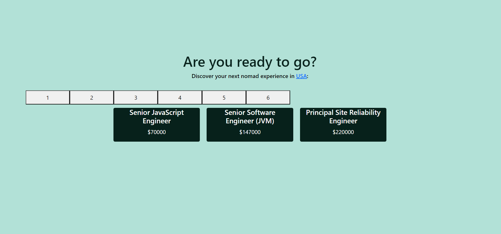
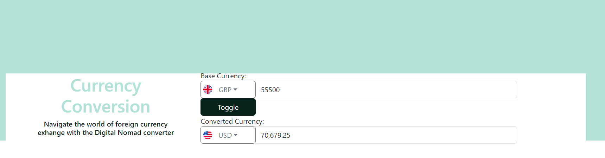

# Digital Nomads App README
# DN-MVP

MVP for digital nomad group project
https://github.com/FilipKotanski/Digital-Nomad-App

# Digital Nomad App

## Overview
Welcome to the Digital Nomad App, a suite of JavaScript applications designed to streamline the job search process for digital nomads. This toolkit consists of three interconnected apps: the **Job Search App**, the **Currency Converter App**, and the **Country Information App**. The HTML uses bootstrap for the intuitive layout. The Digital Nomad App utilises multiple APIs to fetch relevant data and client-side storage to store persistent data.

### Job Search App

#### Overview
This app helps digital nomads find remote jobs worldwide, allowing users to search based on their preferred country, job industry, and minimum annual salary.

#### Code Description
The JavaScript code captures user inputs and provides real-time matching suggestions. It includes event listeners for input fields and a search button, triggering dynamic job searches.

#### Usage
1. Type in the country and job industry fields to receive matching suggestions.
2. Click suggestions to populate input fields and trigger job searches.
3. View search results dynamically displayed below the input fields.

### Currency Converter App

#### Overview
Integrated with the Digital Nomad Job Search App, this tool converts job salaries to the user's local currency based on real-time exchange rates.

#### JavaScript Functions
The code includes functions for fetching exchange rates, toggling currencies, and handling conversion events. Dropdowns provide options for selecting currencies with flags indicating corresponding countries. The dynamic search bar also limits the user's available currency options. 

#### Usage
1. Input amounts in either currency field.
2. Toggle between base and converted currencies.
3. Dropdowns offer currency selection options with corresponding flags.
4. Real-time currency conversion occurs as users input amounts or select currencies.

### Country Information App

#### Overview
Complementing the Job Search App, this tool provides detailed information about the country where the job is located, including country details, news, flag, and location on the map.

#### JavaScript Functions
The code includes functions for fetching news data, displaying flags, presenting country information, and fetching and displaying maps.

#### Usage
1. The **Country Information App** seamlessly integrates with the **Job Search App**. When a user selects a job from the search results, the app automatically sends the job's location (country name) to the **Country Information App**.
2. The **Country Information App** then fetches detailed information about the selected country, providing users with comprehensive insights into the country's information, latest news, and geographical location.
